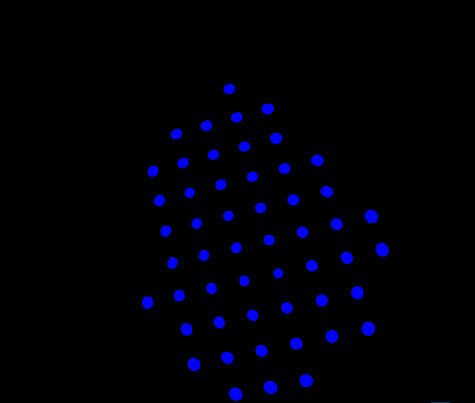
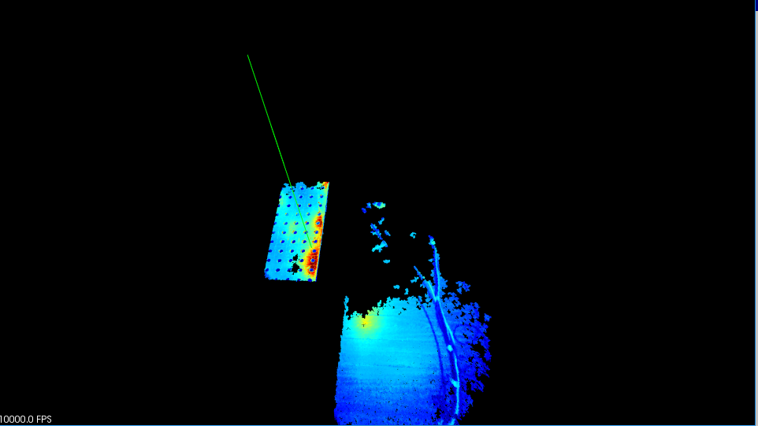
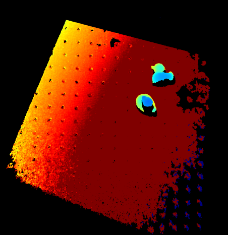

Algorithm which found equation of table plane by 3D cloud points and image information

**Third party: **

```
PCLVisualizer
Opencv
Some core libraries (yaml parser/converter etc)
```
**Short description: **

Algorithm takes on input yaml file from Camera. Algorithm determines from 3D cloud points which are belong to table. 
Such points are detected by closer location to table holes (each table has round holes which contours can be easily detected)

After detection of table 3D points, median regression is used to construct plane equation (take each three points, construct normal vector and obtaining averaging coordinates from all triples) 

Then program performing visualization of such normal vector to 3D points

**Table holes detection**




**Plane visualization**




**Coloring of distance to plane (there are some ducks on the table also) **


